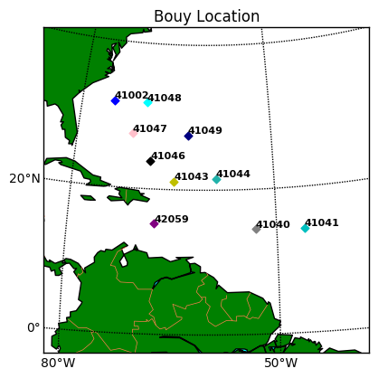
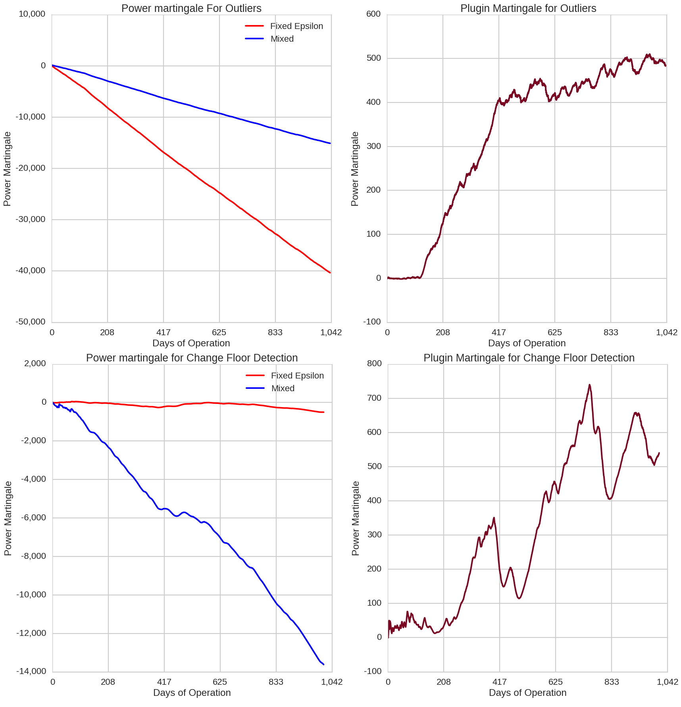
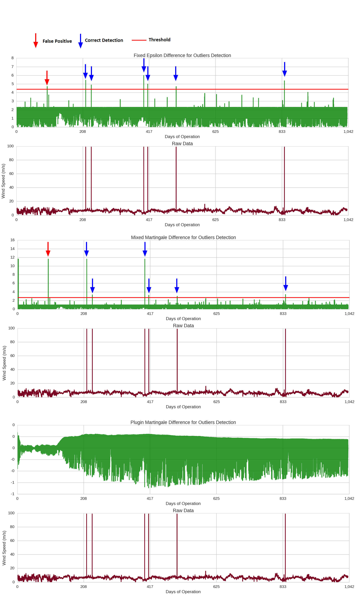
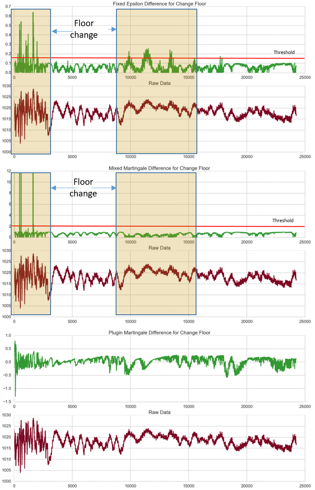
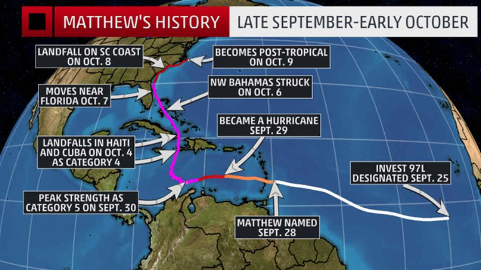
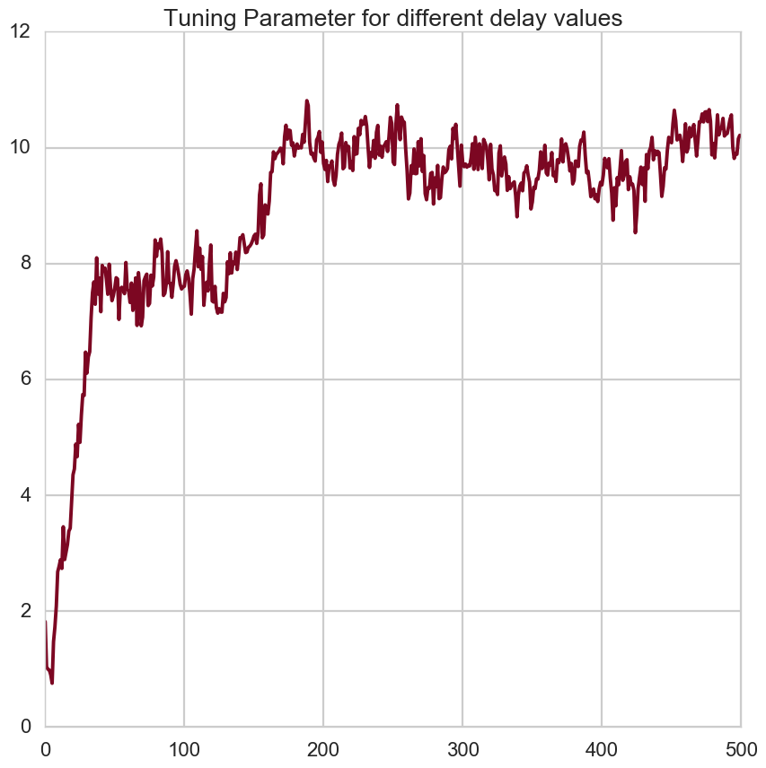

# Anomaly Detection - Zelong
**Harvard University** 
**Fall 2016** 
**Instructors: W. Pan, P. Protopapas, K. Rader** 
 
**Dennis Milechin, Ivan Sunyagin, Hany Bassily**

### Introduction

When looking at streaming data, one may want to get an alert or notification when an anomaly is detected.  An anomaly is an "event" that is not considered normal or expected.  This could consist of streaming data that contains data outside the expected probability distribution or the fact that the properties of the distribution are changing themselves over time, such as variance.  

The detection of anomalies can have various applications.  One may be interested in having a model to detect and alert operators when a sensor is generating abnormal data, which could mean failure of a sensor or an issue with a production line for a product. Anomoly detection could also be applied to other industries, such as finance, economics, and sciences. 

For the Data Science Project, our group developed a model and explored the capabilities of anomaly detection method known as "Testing Exchangeability Online", proposed by Vladimir Vovk et al. (Vovk, 2003). Additionally, a "Plug-in Martingales for Testing Exchability On-Line" was also explored and implemented (Fedorova, 2012).

### Model Description

Their technique is essentially based on the assumption of exchangeability in the data where the joint distribution of observed features does not change under any order permutation of those observations if there is no anomaly in the data. Such approach is very close to the common iid (independent identically distributed) concept. In their technique, they create for each observation a p-value based on a measure of how close the newly observed data point is to all the previously observed ones. Based on the exchangeability assumption, a martingale can be constructed with all the p-values using a joining function (betting function) for all the calculated p-values. The behavior of this martingale is the metric used to assess the presence of an anomaly since any anomaly is assumed to be nonconformal with the exchangeability hypothesis. In this case a high martingale value is an indication of an anomaly (Vovk, 2003).

In Vovk's et al. original work they proposed a power martingale as a betting function. This proposal is totally suitable when there are many small p-values in the sequence. In other words, the data distribution is consistent for most of the sampling time. When there are changes in the data distribution in a way that the calculated p-values are large, the martingale will not grow sufficiently enough when an anomaly occurs to reject the exchangeability assumption (Vovk, 2003).

The martingale is in the form of: 

$$s_n = \prod_{i=1}^{n}f_i(p_i), n = 1, 2, ...$$

Where <i>n</i> represent the observed data and $f_i(p_i)$ represents the betting function in the form of:
$$f_i(p) = \epsilon p^{(\epsilon -1)}$$

Where <i>p</i> are the calculated p-values and epsilon is a value between [0,1] (Vovk, 2003).

Here $\epsilon$ is [0,1] and can be selected according to specific application (Ho et al., 2010). However, another approach where a mix of all possible $\epsilon$ values within the range [0,1] can be applied. In this case, the Mix martingale (Vovk et al., 2003) will take the form of
$$M_n = \int_{0}^{1} M_n^{(\epsilon)}d\epsilon $$

In our analysis, we will apply both approaches, the specified (tuned) $\epsilon$ and the mixed martingale where the integration of all possible values of $\epsilon$ is applied

A variation of this method incorporates a new betting function, known as a "plug-in", in a form of:
$$ \rho_i =  \hat{\rho}(p_1, p_2,...,p_{i-1},p)$$

Where this plug-in represents the joint distribution function of all observed p-values and is used instead of the power martingales.

In our analysis, we will follow the method depicted in Fedorova et al.,2012 for the plugin martingale 

#### Strangeness Functions

In the above equation the <i>p</i> value is calculated based on a measure called the strangeness measure which is a measure for how far the data point is from the "mass". In our analysis, we are considering three types:
 - The jump rate which measures how much change occurs in one time step compared to the average rate. This measure can be effective to detect outliers
 - The variation measure which measures how far a point is from a standardized distribution of the data. This approach is adapted for heterosdatastic anomaly detection
 - The last one which is a distance from the center of the data cluster. This approach is close to the k- mean clustering and is useful for multivariate data analysis
 
For a strangeness measure $\alpha_n$, the <i>p</i> value can be computed as

$$p_i = \frac{\#(i:\alpha_i>\alpha_n) + \theta_n\#(i:\alpha_i=\alpha_n)}{n}$$

Where $\#$ indicates the cardinality and $\theta_n$ is a uniform random number between [0,1]

#### Model Implementation procedure:

According to the literature, three variants of the martingale method can be distinguished and are namely:

 - The Power martingale with predetermined $\epsilon$ value
 - The mix martingale
 - The plugin martingale
 
The implementation will follow the algorithm described in Fedorova et al., 2012 according to the following steps:
 - Data pre-processing including normalization and the application of <i>t</i> step filter. The main purpose of this filter is to reduce the memory content
 
 - computation of the reference strangeness value based on a benchmark data condition or a training data set
 - computation of the p-value based on the developed strangeness measure
 - calculation of the martingale using the calculated p-value

For better computational performance, the logarithmic martingale will be considered instead of the actual martingale. Otherwise, the exponential increase in the martingale value will eradicate the method usefulness.

From this point forward, the expression martingale will always refer to the log(martingale)

As a final step, the change detection of the martingales will be evaluated as a metric to detect the change in the bid progress that can be a signature of an anomaly

### Data

The data considered represents the climatological data gathered from ten Ocean Buoys located in the western Atlantic. The ten Buoy spans the region between southern Bermuda to Puerto Rico. 

<a href = "https://github.com/atikinn/cs109a_anomaly/blob/master/Submission/Show_Bouy_Location.ipynb">Notebook that generates the image</a>

The data includes atmospheric and oceanic information. The buoy considered in this study are owned by NOAA and the National Weather Service. However, there are other buoy operating in the same area owned by different parties. In actual studies, all the data from all the buoys are considered which make this data accessible to all concerned entities. For this project, we are considering the NOAA buoys as their data are available to the public and the contained information is sufficient to the project objective. The following picture depicts how the buoy looks like:

(source: <a href="http://www.ndbc.noaa.gov/station_page.php?station=44065">NOAA</a>)

Each buoy data is divided in separate files where each file corresponds to a specific month. The period considered is between January 2016 and September 2016. The observations are sampled on an hourly basis. The features in the data includes:
<ul>
<li>Wind Direction 
<li>Wind Speed 
<li>Wind Gust
<li>Wave Height
<li>Dominant Wave Period
<li>Average Period
<li>Mean Wave Direction
<li>Atmospheric Pressure
<li>Pressure Tendency
<li>Air Temperature Water
<li>Temperature
<li>Wind Speed at 10 Meters
<li>Wind Speed at 20 Meters
</ul>

For each sensor, missing data is designated as series of 9's, such as 99.0 or 9999.0. These values are converted into null values so that they can be removed prior to applying the data to the anomaly detection models. The following is an example time-series plot of one feature of the data set, representing the Average Wave Period.

<a href="https://github.com/atikinn/cs109a_anomaly/blob/master/Submission/BuoyDataExploration.ipynb">Corresponding notebook with code</a>

The timeseries plot shows the reality of real world data - it is not clean and organized.  With such chaotic data, anomaly detection may prove to be challenging.  Therefor the buoy data is a good data set for testing for anomalies.

All data and modeling files can be obtained from the <a href="https://github.com/atikinn/cs109a_anomaly">Github</a>

###  Testing of the Anomaly Detection Model

The Testing Exchangeability Online and the Plug-in Martingale variation was implemented using Python.  The developed model is available on the following page <a href = "basic_anomalies.html">BasicAnomalies</a>

The main objective was to investigate the applicability of the developed method on different types of anomalies that could exist in the data in hand.

As a demonstration of the model concept, a single variable anomaly is selected. For this purpose both the wind speed and the pressure were selected based on the completeness of the data and the existence of obvious anomalies that could be good candidates for the demonstration. The following figure shows a sample of those two values and the types of anomalies that could be spotted from simple time series visualization.

To check if there is a significant spectral slope in the selected signal that could be a good target for a detection algorithm, a Fast Fourier Transform was executed and no evidence can be spotted for obvious spectral slope as demonstrated in the spectrum below.

Accordingly, the two anomalies that will be considered for the investigation are:

 - Outliers
 - Floor change
 
#### Training and Test

The training and test is essential for the evaluation of the strangeness functions. Since the strangeness measure evaluate how much a data point deviates from a reference condition. For this purpose, the reference condition is determined by the training data set regardless of whether this reference condition is distance, jump rate or a variability measure.

#### Training and Test Data

From the visual inspection, it was found that the data for buoy number 41041 for both the wind speed and the surface pressure are free from outliers and their floor changes are minimal. At the same time, the wind speed data for the other buoys include obvious outliers. Accordingly, the wind speed data was considered for the outlier detection application and the surface pressure data was considered for floor change. The reason for selecting the surface pressure for floor change detection was the existence of floor change signature in the visualization of the 41047 buoy pressure data. Accordingly, the following is determined:
 - The 41041 buoy windspeed and pressure data were selected for training
 - The 41043 buoy windspeed data and 41047 pressure data were selected for the outlier and floor change detection test respectively.
 
#### Martingale Calculation and Strangeness Function

The three candidate strangeness functions were applied for both cases and according to the results for each case it was found that the jump rate is best suited for the outlier detection while the distance was convenient for the floor change detection. Based on the strangeness value, three types of martingales were evaluated: a power martingale with pre-selected $\epsilon$, a mix martingale and a plugin martingale. The following figure displays the three martingales for both the outlier detection and floor change detection.

The value of $\epsilon$ had to be adjusted for each case. A single value was not able to reproduce a satisfactory result for each anomaly type. An $\epsilon = 0.1$ was chosen for the outlier detection and a value of $\epsilon = 0.9$ was selected for the floor change detection. The following figure demonstrates the martingales produced for both the outlier detection and the floor change detection.

It can be seen from the pictures that the power martingales are monotonically decreasing while the plugin martingale is somehow balanced in its behavior. However, there is no obvious indication of any anomaly that can be spotted from the visualization of the martingales in both cases and another process should be used to have more detectability.

#### Change Detection Metric

Based on the monotonicity of the martingale (except when a deviation from exchangeability occurs) it is hard to quantify the amount of deviation caused by an anomaly and a mapping of the generated martingale to a measure space should be applied. For this purpose, the change detection was selected based on the fact that an anomaly will cause the martingale to change the loosing state or the winning state. 

The change detection method was adapted based on Ho et al., 2010. 

Two measures were proposed in the literature, the absolute value threshold value and the difference value threshold. In both cases the threshold is set based on the desired confidence and the type of the data under consideration. The absolute value threshold approach requires that the anomaly persists for a considerable amount of time to ensure that the threshold is violated with an acceptable confidence level. Therefore, the difference would be a more practical approach since it does not require this persistence which suites more intermittent anomalies that are mainly present in the data.

The detection is declared when the change detection difference value exceeds the preset threshold. 

 
** Outliers**

The following figure shows the change detection performance with the three types of martingales for the outliers case.

From the figure it is obvious that all outliers were captured with this setting of the martingales for both the predefined $\epsilon$ case and the mix case. However, some false positives were also declared overall the precision in this case is 0.86 for both the mixed martingale and the power martingale.

The plugin martingale did not work at all in this case.

 
**Floor Change**

The following figure shows the change detection performance with the three martingales for the he floor detection case.

In the figure, it is obvious that the algorithm, even after exhaustive customization was not capable to declare a consistent detection for the whole period where a floor change was existing. In the same time, the plugin martingale also failed in detecting the floor change.

 
**Conclusion**

The following can be stated based on the previous analysis:

 - The martingale method for exchangeability is not robust enough to detect more than one type of anomaly in a way than an overfitting situation can give somehow an acceptable detection precision. That creates a considerable amount of model variance. One possible reason could be the exchangeability assumption itself for time series data where the iid concept may not be applicable.
 
 - The plugin martingale does not perform for this type of anomalies. One reason could be the Gaussian kernel and the application of other kernels is an open issue at this point.

### Application of Model to Detect Hurricane Matthew

We adapted the Testing Exchangeability Online anomaly detection method to see if it could be used in a real  climatological application based on the buoy data. For this purpose, hurricane Matthew was benchmarked for this application for two reasons. The first, the magnitude of the storm: "Hurricane Mathew was the most significant storm to hit the Carribean area in the end September 2016 and into early October 2016 (The Weather Channel, 2016)" 

With quick investigation it was found that two buoys in the Caribbean could be good candidates to build the model upon them, buoy 42059 and 42058 based on the fact that both of them were subjected to only one major event during the 2016 season which is hurricane Matthew and both endured a direct hit <a href="http://komonews.com/weather/scotts-weather-blog/buoy-takes-direct-strike-from-hurricane-matthew-measuring-its-weather-all-the-way">(though one was affected more than the other)</a>. 
Buoy 42059 was used to investigate the different tasks and tune the model and buoy 42058 was seen more suitable for the validation. This is because if we train the model on the strongest evidence we may be underfitting. 

(source: <a href ="https://dsx.weather.com//util/image/w/matthew-history.jpg?v=ap&w=980&h=551&api=7db9fe61-7414-47b5-9871-e17d87b8b6a0">The Weather Channel</a>)

#### Feature Selection and Preprocessing

In this case, the training set will be the data of buoy 42059 and the test set will be the data of buoy 42058. The purpose for the training is to tune the model to achieve maximum detection for the hurricane. 

A subset of the data features is selected based on the most evident signatures of a hurricane which are the wind speed, the wind gust, the surface pressure and the surface temperature

Also the data was normalized and a delay filter is considered. The reason for this filter application is when the power martingale was applied to a long data set, the values calculated based on the raw signal or the normalized signal were causing an overflowing in the processing and it could not be done. The obvious reason was the memory content in the data. In the meantime, the one step differenced data showed better results when the step size increased from 1 to higher numbers that depends on the autocovariance function of the data. Accordingly, the step size was considered as a tuning parameter.

#### Martingale Calculation

Two types of martingales were considered for this task: the power martingale with a pre-selected $\epsilon$ and the mix martingale. The plugin martingale was dropped since it was taking a considerable amount of time for computation and as previously seen it is not convenient for this type of data.

For the case of the power martingale with fixed $\epsilon$, the value of $\epsilon$ was considered a tuning parameter to be defined. 

In this case a strangeness function based on the distance was selected based on its suitability for the multivariate case.

#### Model Tuning

<a href="https://github.com/atikinn/cs109a_anomaly/blob/master/Submission/Matthew_tuning.ipynb">Notebook Matthew_tuning.ipynb</a>

For the purpose of tuning the model, the data from buoy 42059 was considered. Since only one event is present in the data, a cross validation technique cannot be applied. Hence, the tuning will be based on varying the model's tunable parameters to achieve an optimum performance score for the hurricane detection. This score is described below.

The model tuning is different from the power martingale with fixed $\epsilon$ and the Mix martingale. In the first case the tuning is performed for two parameters and in the second, the tuning is performed for the delay to be applied for the difference filter. 

The criteria (or score) to be used for the tuning is in fact the maximum detectability of the hurricane. In other words, the model is tuned to achieve a maximum value of the change detection in the hurricane.

The following figure displays a qualitative heatmap of the selected score value with tuning both the $\epsilon$ and the delay for the first power martingale.

According to this tuning, it was found that a delay value of 189 time steps with an epsilon value of 0.307 achieves the maximum detectability.

For the Mixed martingale case, when tuning for the delay, a value of 189 was also found to achieve the maximum hurricane detectability.

#### Change Detection

As previously discussed, the difference change detection measure was found more convenient for the application.  However, one difficulty existed which is the considerable amount of noise in the Martingale difference. For this reason, a smoothing function based on an exponential filter was added to the change detection difference. After this addition, the change detection method became a very convenient method to evaluate the hurricane signature in the data.

#### Tuning Results

The tuning results for the power martingale with the two parameters: delay and $\epsilon$ are shown in the following figure. The best delay was found to be 189 time steps and the best $\epsilon$ was found to be 0.307

The tuning results for the mix martingale for best delay were found to be close to the first case. The following figure displays the comparison between both tuned methods. 

#### Detection

<a href="https://github.com/atikinn/cs109a_anomaly/blob/master/Submission/Matthew_Detection.ipynb">Notebook Matthew_Detection.ipynb</a>

When the the model applied to the buoy 42058 data which is supposed to be exactly in the path of the hurricane the following results were obtained.

 

A qualitative representation of the difference between both methods can be shown in the following figure.

 

 
In the above figures, the eye of the hurricane can be distinguished as a dip in the detection.

 
#### Conclusion

 - This application demonstrates the fact that the method can be adapted to a single type of anomaly after exhaustive tuning and data preprocessing
 - The hurricane detection was performed using a subset of the data that are more representative to the type of the weather anomaly of interest.
 - It is important to mention that the selection of the multivariate set of signals is crucial. The hurricane signature could be diluted if some selected features do not record the hurricane anomaly and hence the model performance could be severely hampered. Non-robustness of the method attributes to that as well.

### Results

For this project, we explored a method of identifying anomalies by Testing Exchangeability Online and a variation of this method using a Martingale Plug-in.  Based on these results, we can summarize the following findings:
 - This method is based on the exchangeability in the data which cannot be guaranteed in time series data with memory content (significant autocovariance value at time lags > 1).
 - The main effect for this independence assumption was the fact that the method was not robust enough and excessive tuning was required to detect a specific type of anomaly in a context similar to an overfitting situation for any classifier or regression model whereas in this case the expected response was the anomaly to be detected.
 - Some pre-processing of the data that can help reduce the memory component of the variance can mitigate the impact but not eliminate it.
 - Another effect of the data variance memory component is the rapid absolute growth of the martingale which poses a deficiency for big data application. 
 - The plugin martingale requires a considerable amount of computational resources to fit a distribution at each time step which makes it non practical for big data application.
 
According to the above, the following represents the expected performance of this method for specific data setups:

** Long memory Content Data:**

The method is not suitable unless a mapping is performed to the data to lessen the effect of the data variance memory content. The applied mapping in this analysis was the <i>t</i> time step difference.

** Non regular sampling interval:**

The martingale exchangeability test does not take into account the sampling rate. The calculation is mainly based on the actual signal value. Accordingly, data with non uniform sample rate can be be effeciently processed by this method. 

However, one consideration should be taken into account which is the strangeness measure. If the strangness measure is calculated based on a temporal component, the sample rate variation should be accounted for. An example of such strangeness measure is the jump rate which is used in our analysis.

In this case, the calculation of the jump rate should be calculated as the result of the actual variation in the value devided by the actual time between two consecutive samples instead of considering simply the variation of the value without the time between the two samples.

** Big data application:**

In order to be practical for big data application two factors should be satisfied:
 - Minimum memory content in the data variance to prevent any overflowing in evaluating the martingales.
 - Select a type of power martingale that is not computationally exhaustive. In our case, the power martingale with predefined epsilon could be a good candidate since it does not include the integration step of the mixed martingale and the exhaustive distribution fit of the plugin martingale. In our example, it was found that for 22000 observations the computation time for each method was:
  - 6 seconds for the power martingale with predefined $\epsilon$
  - 13 seconds for the mixed martingale
  - 300 seconds for plugin martingale with Gaussian kernel and Silverman rule for bandwidth selection.
  
** High dimension data:**

The real interface between the actual data and the martingale computation is the strangeness function. If the strangeness function is capable to handle high dimension data, the method can be applied.

The strangeness function can also accommodate some dimension reduction techniques like the principal component analysis for high dimension data.

In our analysis we used a strangeness function based on the distance between clusters which was convenient to data with more than one dimension.

### Conclusion

The results from our exploration indicate that Testing Exchangeability Online is an anomaly detector for time series data that can have an acceptable performance if specifically tailored for an anomaly type.

A file containing the model to be used is linked here <a href="">Notebook ProductionModel</a>

However, the shortfalls experienced throughout this analysis can be attributed to the fact that the exchangeability is better suited for time series data with small memory variance component. The other disadvantage comes from the martingale function which is based on a cumulative evaluation that is not sensitive enough to short transient anomalies. Some mitigation to the later condition can be achieved by selecting a specific strangeness function that can capture these types of anomalies with high confidence. However, the outcome of different types of these anomalies should be evaluated on a case by case basis.

According to the presented analysis, the following can be proposed as open points for future investigation:

 - In order to consider the memory component, a strangeness function based on a time window of data can be adapted using the autocovariance function for considered time steps as a basis for the strangeness calculation
 
 - The detection threshold determination was not clear in the literature and an arbitrary value was applied for the different cases in this analysis. We propose a threshold value calculated based on the actual martingale function slope. This approach will tie the threshold confidence to the actual behavior of the martingale function
 
 - For the plugin martingale, an adaptive method can be investigated to relax the conditions for the Gaussian kernel and the heavy computational load incurred by reflecting the p-values for distribution calculation. RBF can speculatively be an alternative to be considered.

### Citations

<ol>
<li>Vladimir Vovk, Ilia Nouretdinov, Alex J. Gammerman, “Testing
Exchangeability Online”, ICML 2003.
<li>Shen-Shyang Ho; Wechsler, H., "A Martingale Framework for Detecting
Changes in Data Streams by Testing Exchangeability," Pattern Analysis
and Machine Intelligence, IEEE Transactions , vol.32, no.12, pp.
2113,2127, Dec. 2010
<li>Valentina Fedorova, Alex J. Gammerman, Ilia Nouretdinov, Vladimir Vovk,
“Plug-in martingales for testing exchangeability on-line”, ICML 2012
<li>National Oceanic and Atmospheric Administration (NOAA). "National data Buoy Center." <http://www.ndbc.noaa.gov/> Oct. 2016.
<li>The Weather Channel.  "Hurricane Matthew Recap: Destruction From the Caribbean to the United States. <https://weather.com/storms/hurricane/news/hurricane-matthew-bahamas-florida-georgia-carolinas-forecast>, Oct. 2016.
</ol>
